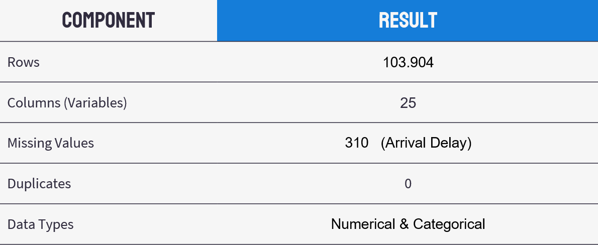
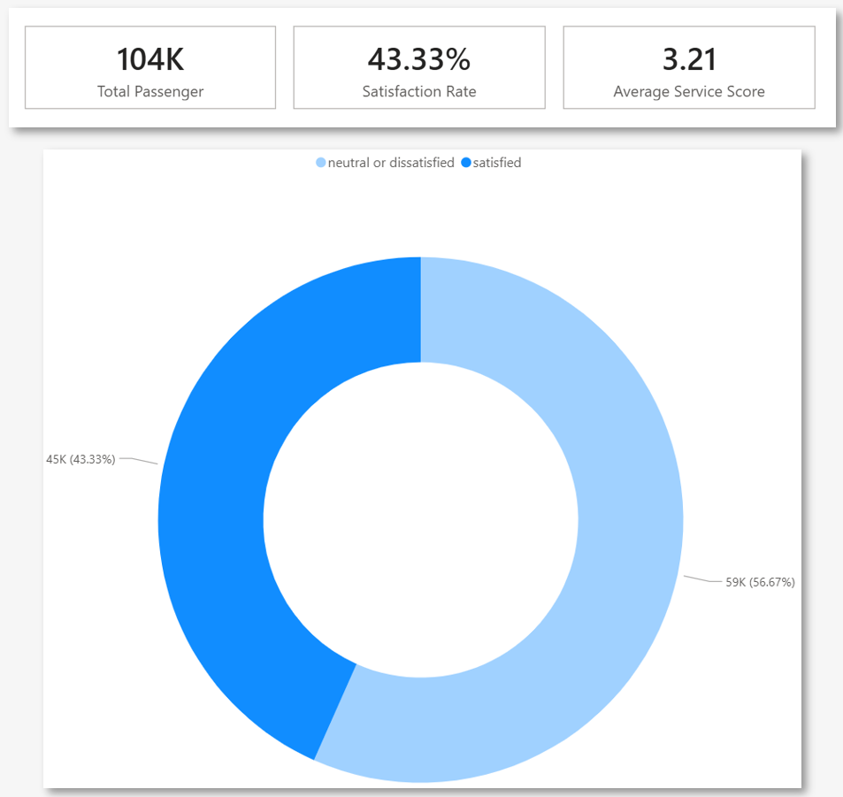
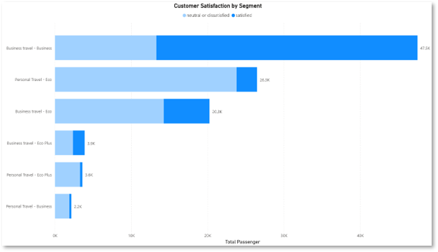
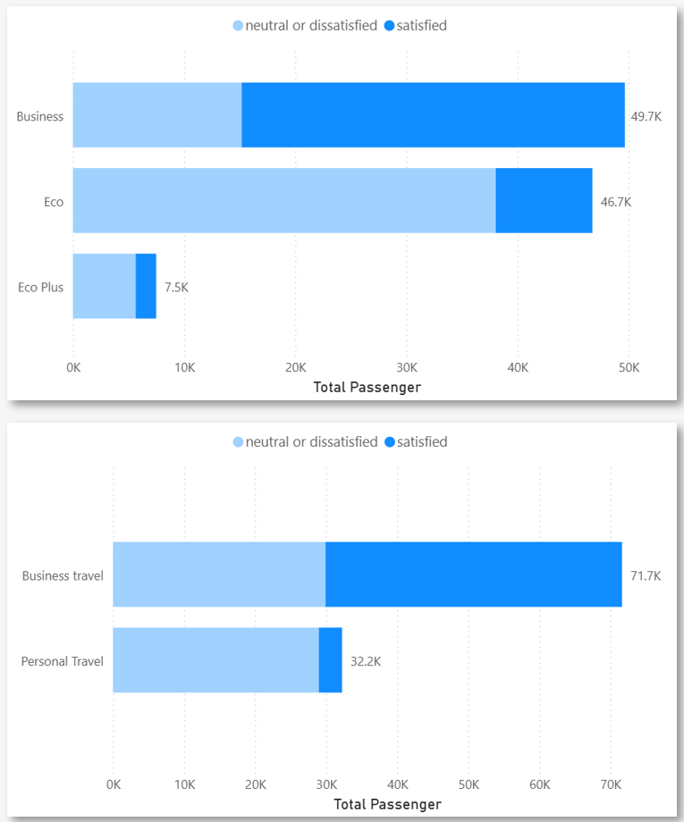
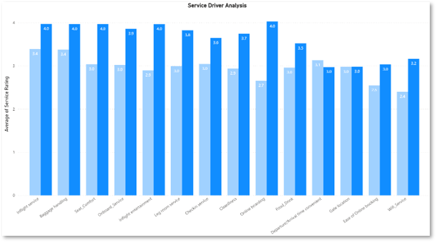
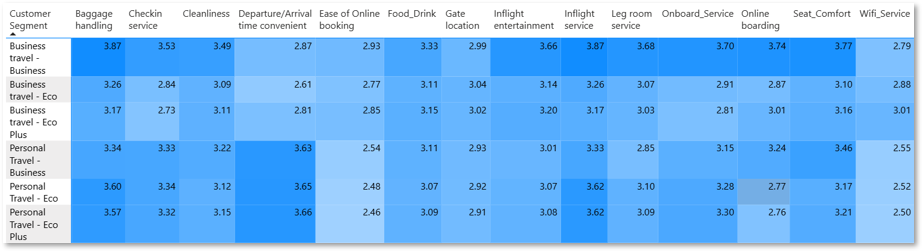
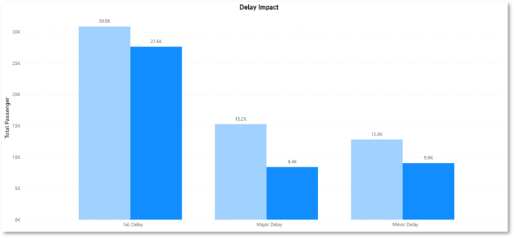

# Airline Passenger Satisfaction Analysis

## Executive Summary

This project analyzes passenger satisfaction patterns within the airline industry to identify service attributes that most influence customer satisfaction across different passenger segments.

The analysis focuses on customer segmentation, service quality evaluation, and operational factors to support strategic service improvement decisions.

---

## Key Results

- Identified strong satisfaction differences across passenger segments
- Found business travelers in business class as the highest satisfaction group
- Detected extremely low satisfaction within economy personal traveler segments
- Identified service quality as the strongest satisfaction driver
- Evaluated delay impact on customer satisfaction
- Developed segment-specific service improvement recommendations

---

## Project Links

- Dashboard: Coming Soon
- Notebook: Coming Soon
- Dataset: Airline Passenger Satisfaction Dataset (Kaggle)

---

## 1. Business Context

Customer satisfaction plays a critical role in airline competitiveness and customer retention.

This project evaluates how passenger segment characteristics, service quality, and operational performance influence overall customer satisfaction within the airline industry.

---

## 2. Problem Statement

How can airlines identify the service attributes that most influence satisfaction across different passenger segments to improve service investment decisions?

Supporting analytical areas:

1. Passenger segmentation analysis
2. Service quality evaluation
3. Satisfaction driver identification
4. Operational impact analysis

---

## 3. Dataset Overview

The analysis used the Airline Passenger Satisfaction dataset from Kaggle.

### Dataset Scale

- 103K+ passenger records
- 25 variables
- Numerical & categorical features
- Airline customer experience data

### Main Variables

- Passenger type
- Travel class
- Travel purpose
- Service ratings
- Flight delay information
- Overall satisfaction

---

## 4. Data Preparation

Data preprocessing steps included:

- Missing value handling
- Delay feature cleaning
- Service score aggregation
- Passenger segmentation engineering
- Delay category transformation

### Feature Engineering

- Delay Category:
  - No Delay
  - Minor Delay
  - Major Delay

- Service Score:
  - Aggregated service quality rating

- Segment Combination:
  - Travel Type + Class segmentation

---

<!-- INSERT VISUAL: Dataset Overview Dashboard -->

## 5. Satisfaction Overview

<!-- INSERT VISUAL: Satisfaction Overview Dashboard -->

The analysis evaluated:

- Overall passenger satisfaction distribution
- Average service score
- Passenger satisfaction ratio
- Overall service quality perception

### Key Findings

1. Only 43% of passengers were classified as satisfied.
2. 57% of passengers remained neutral or dissatisfied.
3. Average service score reached 3.21 out of 5.

### Business Interpretation

The airline demonstrated significant customer satisfaction challenges, indicating substantial opportunities for service quality improvement and customer experience optimization.

---

<!-- INSERT VISUAL: Customer Satisfaction by Segment -->

<!-- INSERT VISUAL: Travel Type vs Satisfaction -->

## 6. Passenger Segment Analysis

The analysis focused on comparing satisfaction patterns across:

- Business vs Personal travelers
- Economy vs Business class
- Combined passenger segments

### Key Findings

1. Business travelers in business class showed the highest satisfaction levels.
2. Personal travelers in economy segments showed the lowest satisfaction levels.
3. Customer expectations varied significantly across segments.
4. Travel type and class strongly influenced customer satisfaction outcomes.

### Business Interpretation

Customer satisfaction is highly segment-dependent. Premium passengers demonstrate higher service responsiveness, while economy personal travelers represent the largest dissatisfaction risk group.

---

<!-- INSERT VISUAL: Service Quality Driver Analysis -->

<!-- INSERT VISUAL: Service Attribute Comparison by Segment -->

## 7. Service Quality Analysis

The analysis evaluated the relationship between service attributes and satisfaction outcomes.

### Main Service Attributes

- Seat Comfort
- On-board Service
- Cleanliness
- Check-in Service
- Food & Drink
- Inflight Entertainment
- WiFi Service

### Key Findings

1. Higher service ratings strongly correlated with customer satisfaction.
2. Seat comfort, onboard service, and cleanliness showed the strongest impact.
3. Business travelers demonstrated higher sensitivity toward service quality.
4. Personal travelers showed relatively lower responsiveness to service improvements.

### Business Interpretation

Service quality remains the strongest driver of passenger satisfaction, especially within premium passenger segments where customer expectations are significantly higher.

---

<!-- INSERT VISUAL: Delay Impact Analysis -->

## 8. Operational Delay Analysis

The analysis evaluated how flight delays affected passenger satisfaction.

### Key Findings

1. Increased delays were associated with lower satisfaction levels.
2. Delay impact existed but remained smaller than service quality influence.
3. Major delays significantly increased dissatisfaction risk.

### Business Interpretation

Operational reliability contributes to customer experience quality, but service excellence remains the primary satisfaction determinant.

---

## 9. Key Insights

1. Passenger satisfaction differs significantly across customer segments.
2. Service quality is the strongest customer satisfaction driver.
3. Premium passengers demonstrate higher service sensitivity.
4. Economy personal travelers represent the largest dissatisfaction segment.
5. Flight delays negatively affect satisfaction but are not the dominant factor.

---

## 10. Business Implications

This analysis demonstrates how customer analytics frameworks can support:

- Service investment prioritization
- Segment-based service strategy
- Customer experience optimization
- Operational decision making
- Retention improvement strategy
- Premium customer management

Different customer segments require different service strategies and investment priorities.

---

## 11. Recommendations

### High-Impact Segment Prioritization

- Maintain and enhance premium business-class experience
- Prioritize dissatisfaction reduction within economy segments
- Focus retention efforts on high-value passengers

### Service Quality Improvement

- Improve seat comfort and onboard experience
- Strengthen cleanliness consistency
- Optimize customer-facing service interactions

### Segment-Specific Strategy

- Develop differentiated service strategy across segments
- Improve value perception for personal travelers
- Customize service investment priorities by passenger type

### Operational Optimization

- Reduce major delays strategically
- Balance operational investment with service quality improvement
- Improve disruption handling and passenger communication

---

## Tools Used

- Python
- Pandas
- Matplotlib
- Seaborn
- Power BI
- Jupyter Notebook
- Git & GitHub
