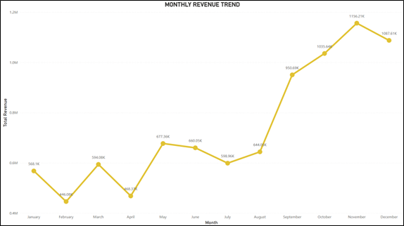
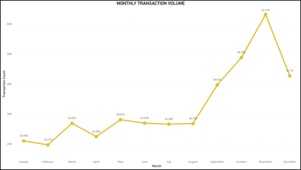
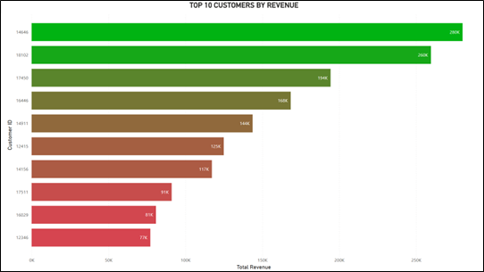
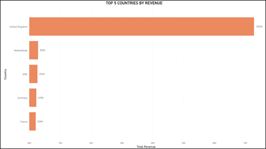
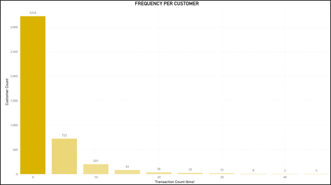
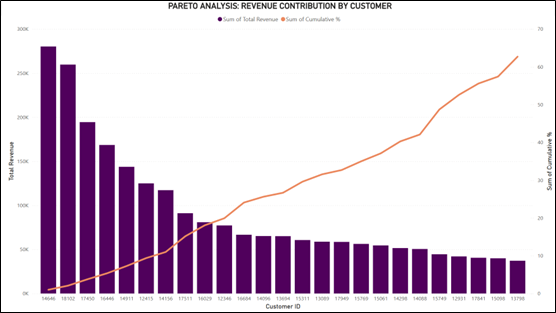
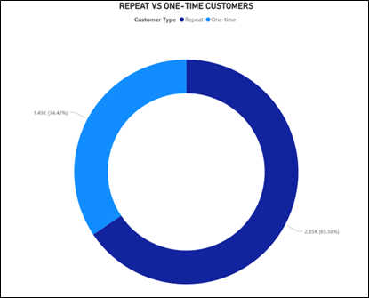
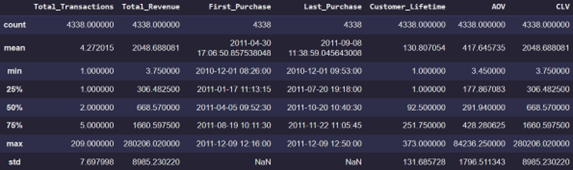

# Customer Lifetime Value (CLV) & RFM Analysis

## Executive Summary

This project analyzes customer purchasing behavior using RFM segmentation and Customer Lifetime Value (CLV) analysis to support customer retention strategy, revenue optimization, and customer prioritization.

The analysis focuses on identifying high-value customers, churn-risk customers, purchasing behavior patterns, and revenue concentration within an online retail business environment.

---

## Key Results

- Performed RFM customer segmentation
- Calculated Customer Lifetime Value (CLV)
- Identified high-value and at-risk customer groups
- Detected strong Pareto revenue concentration
- Evaluated transaction frequency and customer retention patterns
- Developed data-driven customer retention recommendations

---

## Project Links

- Notebook: Coming Soon
- Dashboard: Coming Soon
- Dataset: Online Retail UCI Dataset

---

## 1. Business Context

Understanding customer purchasing behavior is essential for improving retention, maximizing revenue, and optimizing marketing strategy.

This project applies RFM segmentation and CLV analysis to identify valuable customers, customer churn risk, and long-term customer contribution patterns.

---

## 2. Problem Statement

How can transactional customer data be analyzed to:

1. Identify high-value customer segments
2. Detect customers at risk of churn
3. Improve retention and revenue optimization strategies
4. Support personalized customer targeting

---

## 3. Dataset Overview

The analysis used the Online Retail UCI dataset containing ecommerce transaction records from a UK-based online retail company.

### Dataset Scale

- 541K+ transactional records
- 4.3K+ unique customers
- 25K+ unique transactions
- Observation period: Dec 2010 – Dec 2011

### Main Variables

- Invoice information
- Customer ID
- Product details
- Quantity
- Unit Price
- Transaction timestamp
- Country

---

## 4. Data Preparation

Data preprocessing steps included:

- Missing value handling
- Duplicate removal
- Negative quantity filtering
- Invalid unit price filtering
- Revenue feature engineering
- Customer-level aggregation

### Final Dataset

- 392K+ cleaned transaction records
- No missing CustomerID
- No invalid Quantity or UnitPrice values

---

## 5. Exploratory Business Analysis

<!-- INSERT VISUAL: Monthly Revenue Trend -->

<!-- INSERT VISUAL: Monthly Transaction Volume -->

<!-- INSERT VISUAL: Top Customers by Revenue -->

<!-- INSERT VISUAL: Top Countries by Revenue -->

The analysis focused on evaluating:

- Revenue growth patterns
- Transaction behavior
- Customer contribution distribution
- Country-based revenue concentration
- Product performance
- Transaction value distribution

### Key Findings

1. Revenue and transaction volume demonstrated strong seasonal patterns.
2. Revenue peaked significantly toward the end of the year.
3. Revenue contribution was heavily concentrated among a small group of customers.
4. United Kingdom dominated overall revenue contribution.
5. Most transactions consisted of relatively low-value purchases.

### Business Interpretation

The business demonstrated strong dependence on repeat purchasing behavior and high-value customers. Revenue concentration patterns highlighted the importance of customer retention and high-value customer management.

---

<!-- INSERT VISUAL: Frequency per Customer Distribution -->

<!-- INSERT VISUAL: Pareto Revenue Contribution Chart -->

<!-- INSERT VISUAL: Repeat vs One-Time Customer Chart -->

## 6. Customer Behavioral Analysis

The analysis evaluated customer transaction frequency, repeat purchasing behavior, and revenue contribution concentration.

### Key Findings

1. Most customers were low-frequency buyers.
2. Repeat customers represented the majority of the customer base.
3. Revenue followed the Pareto principle, where a small customer group generated most revenue.
4. Customer purchasing behavior varied significantly across segments.

### Business Interpretation

A relatively small group of loyal customers played a critical role in sustaining overall business revenue, making customer retention a strategic priority.

---

## 7. RFM Analysis

Customers were segmented based on:

- Recency
- Frequency
- Monetary Value

### Main Segments

- At Risk Customers
- Loyal Customers
- Recent Customers
- Frequent Customers
- Others

### Key Findings

1. The largest customer segment consisted of At Risk customers.
2. Loyal customers contributed significantly to total revenue.
3. Customer behavior demonstrated strong variability across segments.
4. Many customers showed signs of inactivity and potential churn risk.

### Business Interpretation

The large proportion of At Risk customers indicates the need for proactive retention and reactivation strategies to reduce potential customer churn.

---

<!-- INSERT VISUAL: CLV Distribution Chart -->

## 8. Customer Lifetime Value (CLV) Analysis

CLV analysis was performed to measure long-term customer contribution and prioritize retention strategy.

### CLV Segments

- Low Value Customers
- Medium Value Customers
- High Value Customers

### Key Findings

1. High Value customers generated disproportionately large revenue contribution.
2. Low Value customers demonstrated minimal transaction activity and shorter customer lifetime.
3. Medium Value customers showed strong upselling and growth potential.
4. Customer value distribution was highly uneven across segments.

### Business Interpretation

Long-term business growth depends heavily on retaining and expanding high-value customer relationships while improving conversion pathways for medium-value customers.

---

## 9. Key Insights

1. Customer revenue contribution follows strong Pareto distribution patterns.
2. Repeat purchasing behavior significantly impacts long-term business sustainability.
3. A large portion of customers are categorized as churn-risk segments.
4. High-value customers contribute disproportionately to total revenue.
5. Medium-value customers represent strong growth opportunities.

---

## 10. Business Implications

This analysis demonstrates how customer analytics frameworks can support:

- Customer retention optimization
- Revenue growth strategy
- Customer prioritization
- Personalized marketing strategy
- Churn reduction initiatives
- Business expansion planning

Combining RFM and CLV analysis enables more targeted and sustainable customer relationship management.

---

## 11. Recommendations

### High-Value Customer Retention

- Implement loyalty and membership programs
- Provide exclusive offers and personalized experiences
- Prioritize retention-focused engagement strategy

### At-Risk Customer Reactivation

- Launch win-back campaigns
- Implement retargeting strategies
- Provide repurchase incentives

### Revenue Optimization

- Increase AOV through bundling and upselling
- Optimize product recommendation strategy
- Encourage repeat purchasing behavior

### Customer Growth Strategy

- Personalize campaigns for medium-value customers
- Improve engagement progression toward higher-value segments
- Develop targeted customer lifecycle strategies

### Market Diversification

- Explore international market expansion opportunities
- Reduce overdependence on single-country revenue concentration
- Adapt marketing strategies for regional customer behavior

---

## Tools Used

- Python
- Pandas
- Matplotlib
- Seaborn
- Power BI
- Jupyter Notebook
- Git & GitHub
