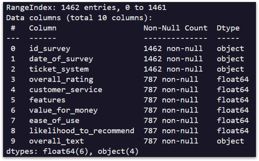
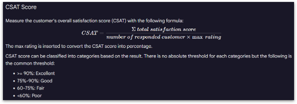
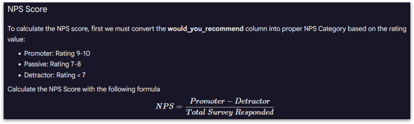
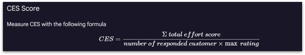
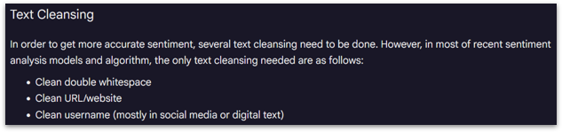
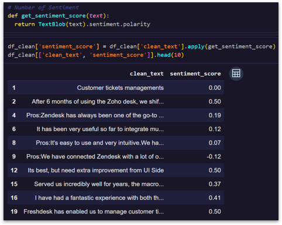
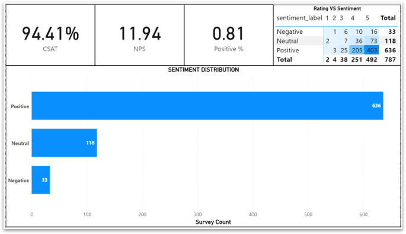

# Customer Satisfaction & Sentiment Analysis

## Executive Summary

This project combines customer satisfaction metrics and sentiment analysis to evaluate customer perception, loyalty potential, and hidden dissatisfaction patterns within a ticketing system environment.

The analysis integrates structured customer metrics with textual feedback analysis to generate deeper customer experience insights and support service improvement strategy.

---

## Key Results

- Measured CSAT, NPS, and CES metrics
- Performed sentiment analysis on customer reviews
- Identified mismatch between ratings and textual sentiment
- Detected hidden dissatisfaction signals
- Developed customer experience improvement recommendations

---

## Project Links

- Notebook: Coming Soon
- Dashboard: Coming Soon
- Dataset: Customer Satisfaction Survey Dataset

---

## 1. Business Context

Customer feedback provides valuable insights into customer satisfaction, loyalty, and service quality perception.

This project combines quantitative customer metrics and qualitative sentiment analysis to better understand customer experience and identify improvement opportunities within a ticketing system platform.

---

## 2. Problem Statement

How can customer ratings and textual feedback be analyzed to:

1. Measure customer satisfaction and loyalty
2. Identify hidden dissatisfaction patterns
3. Evaluate customer experience quality
4. Support customer retention and service improvement strategy

---

## 3. Dataset Overview

The dataset contains customer satisfaction survey responses related to a ticketing system platform.

### Dataset Scale

- 1,462 customer survey responses
- 10 main variables
- Customer ratings & textual reviews
- Service quality dimensions

### Main Variables

- Overall Rating
- Customer Service
- Features
- Value for Money
- Ease of Use
- Likelihood to Recommend
- Customer Review Text

---

## 4. Data Preparation

Data preprocessing steps included:

- Missing value handling
- Filtering incomplete survey responses
- Datetime conversion
- Text preprocessing and cleansing
- Sentiment labeling preparation

### Final Dataset

- 787 complete customer survey records
- Cleaned textual review dataset
- Standardized sentiment-ready text data

---

<!-- INSERT VISUAL: Dataset Structure Overview -->

## 5. Customer Satisfaction Analysis

<!-- INSERT VISUAL: CSAT Formula & Method -->

<!-- INSERT VISUAL: NPS Formula & Method -->

<!-- INSERT VISUAL: CES Formula & Method -->

The analysis evaluated customer experience using:

- CSAT (Customer Satisfaction Score)
- NPS (Net Promoter Score)
- CES (Customer Effort Score)

### Key Findings

1. CSAT score reached 94.41%, indicating strong customer satisfaction.
2. NPS score remained relatively low at 11.94.
3. Customers were generally satisfied but not strongly motivated to recommend the product.
4. Customer effort remained an important experience factor.

### Business Interpretation

Although customers expressed high satisfaction levels, loyalty and advocacy potential remained relatively moderate. This indicates opportunities to improve long-term customer engagement and recommendation behavior.

---

<!-- INSERT VISUAL: Text Preprocessing Workflow -->

<!-- INSERT VISUAL: Sentiment Scoring Process -->

## 6. Sentiment Analysis

Sentiment analysis was performed on customer review text using lexicon-based sentiment scoring.

### Methodology

The process included:

- Text preprocessing
- Text cleansing
- URL and username normalization
- Sentiment polarity scoring using TextBlob
- Sentiment classification

### Sentiment Categories

- Positive
- Neutral
- Negative

### Key Findings

1. Positive sentiment dominated customer feedback (~81%).
2. Neutral sentiment remained relatively significant.
3. Negative sentiment represented a small but important portion of feedback.
4. Customer perception was generally positive across the platform.

### Business Interpretation

Positive customer perception indicates strong overall product acceptance. However, neutral and negative feedback still provide critical opportunities for customer experience improvement.

---

## 7. Validation Analysis

The analysis compared textual sentiment results against numerical customer ratings.

### Key Findings

1. Most high ratings aligned with positive sentiment.
2. Several high-rating reviews contained negative sentiment signals.
3. Hidden dissatisfaction patterns were identified despite positive ratings.

### Business Interpretation

Numerical ratings alone may not fully capture customer perception. Combining sentiment analysis with customer metrics enables more comprehensive customer experience evaluation.

---

<!-- INSERT VISUAL: Final Dashboard Overview -->

## 8. Dashboard Insights

The dashboard integrates:

- CSAT metrics
- NPS analysis
- CES analysis
- Sentiment distribution
- Rating validation
- Customer perception insights

### Main Dashboard Insights

1. Customer satisfaction was generally high.
2. Loyalty potential remained weaker than satisfaction performance.
3. Hidden dissatisfaction may increase long-term churn risk.
4. Neutral sentiment indicates opportunities for customer experience enhancement.

---

## 9. Key Insights

1. High satisfaction does not automatically guarantee strong customer loyalty.
2. Textual feedback provides deeper insight beyond numerical ratings.
3. Hidden dissatisfaction can exist even among high-rating customers.
4. Combining structured metrics and NLP analysis improves customer understanding.

---

## 10. Business Implications

This analysis demonstrates how customer analytics and NLP frameworks can support:

- Customer experience monitoring
- Loyalty evaluation
- Churn risk identification
- Customer retention strategy
- Service quality improvement
- Sentiment-based customer insight generation

The integration of customer metrics and sentiment analysis enables more nuanced customer behavior evaluation.

---

## 11. Recommendations

### Customer Experience Improvement

- Simplify customer service and platform usability
- Reduce customer effort during service interaction
- Improve issue resolution efficiency

### Loyalty & Retention Strategy

- Focus on converting passive customers into promoters
- Improve long-term customer engagement initiatives
- Develop personalized customer experience strategy

### Negative Feedback Monitoring

- Analyze recurring negative feedback themes
- Identify root causes of hidden dissatisfaction
- Implement proactive issue monitoring

### Positive Feedback Utilization

- Use positive reviews for marketing and testimonials
- Strengthen trust-building campaigns
- Leverage customer advocacy opportunities

---

## Tools Used

- Python
- Pandas
- TextBlob
- Power BI
- Jupyter Notebook
- Git & GitHub
